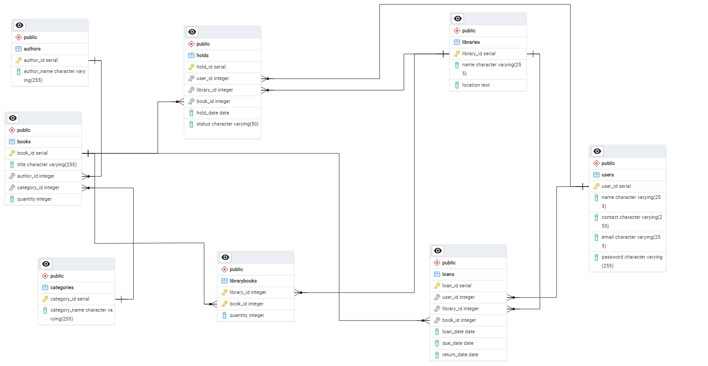

# e-library_Database_System
Project to develop a comprehensive and user-friendly e-library platform (as part of Pacmann AI Program: SQL and Relational Database)

## Database Design
### Mission Statement: 

To develop a database and accomodate user-friendly e-library platform that empowers users to access a vast collection of books from multiple libraries, facilitating easy borrowing and accomodate queuing hold system.

### Business Rule
1. Scalable multiple libraries
   * handle multiple libraries includes its growing number and book collections
2. Comprehensive Book Collection
   * Maintain a diverse collection of books including information of title, author, genre, and categorized for ease of searching
   * Ability to provide up-to-date books availability information
3. User data and interface
   * Manage user information
   * Possibility to provide user interface in borrow books, place hold queue, and managing their account
4. Borrow and Hold Management
   * managing book loans, including tracking loan dates, due dates, and return dates
   * member's borrow and hold limitation system

### Table Structure
Table and its relational is created using sql (Postgresql). The Data Definition Language (DDL) syntax can be found in the [file](e_library_table.sql)

ERD

## Create Dummy Data
Dummy data for development are creating using Python libraries such as Panda and Faker, the script (using notebook in Collaborator) is available [here](e-library_dummy.ipynb)

Comment were written for each data table generation, you could freely modify the number of data by modifying range in the script.

## Data Analysis
The generated dummy data could be imported to database using the import tools of postgresql or copy statement.

This data could be utilized as an data analysis practice, e.g for below questions:
1. Which books have highest number of loans?
   *The result will shows the popular books, and could be utilized to consider book copies availability and procurement strategy
2. What are the most popular book categories?
   *Similar with above questions, it will shows popular book categories which correlates with the user interest
3. Which users has borrowed the most books?
   *It could shows the most active users and help to strategize promotion or rewards campaign
4. Which libraries have the most number of holds?
   *This could gives insight in the library operation and books distribution or logistics
5. Which books have the highest number of holds?
   *The result will shows the lack availability of books and help to identify the procurement needs
The SQL query for above questions could be found in the [file](e_library_analytics.sql)

The database structure has possibility to be implemented for other rental applications or even pre-order type store.

Feel free to use it.
